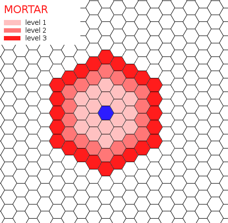
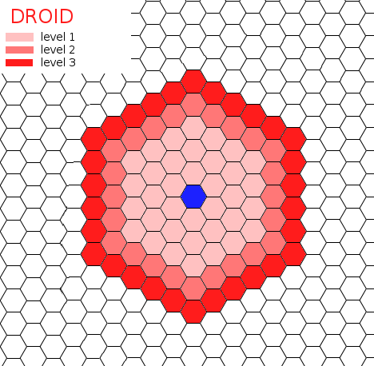

#SKYPORT REV 1 SPILL REGLER
========================

##SAMMENDRAG

Dette dokumentet tar for seg reglene i spillet, implementert av serveren.

##KART

Kartet er et sekskantet rutenett. Se PROTOCOL_NO/KART-OBJEKT for videre
informasjon. Kartet bruker et koordinatsystem likt det i et vanlig firkantet
rutenett:

     J-Koordinat                       K-Koordinat
      \                               /
       \                             /
        \                _____      /
         \         <0>  /     \  <0>
          \            /       \
           \     ,----(   0,0   )----.
            <1> /      \       /      \ <1>
         _____ /  1,0   \_____/  0,1   \_____
    <2> /      \        /     \        /     \  <2>
       /        \      /       \      /       \
      (   2,0    )----(   1,1   )----(   0,2   )
       \        /      \       /      \       /
        \_____ /  2,1   \_____/  1,2   \_____/
               \        /     \        /
                \      /       \      /
                 `----(   2,2   )----'
               .       \       /      .
              .         \_____/        .
             .                          .
	      
Rutenes posisjon er alltid skrevet [J,K]; J-koordinatet kommer alltid først og
K-koordinatet sist. For eksempel; en AI vil kanskje sende en melding om å "flytte
til posisjonen 1,0" og så "angrip med mortar (granatkaster) på posisjonen
2,2". Serveren vil da flytte AI'en til posisjon [2,0] og angripe posisjonen
[2,2].  
Du kan bevege deg mellom ruter over grensene mellom rutene, og opp til 3 ruter på
en tur.
Det er syv forskjellige rute typer, dette vil bli forklart nærmere i neste avsnitt.

##RUTER

###FARBARE RUTER (ruter du kan flytte til)
* **GRESS**	- Gressrute. Ingen spesiell effekt. Kan komme i flere farger og
former, men roboter er ikke opptatt av estetikk.  
* **EXPLOSIUM**	- Hvis du står på denne ruten kan du bruke en eller flere 
handlinger på å utvinne explosium ressurs, 1 ressurs per handling. Hver explosium
 rute har maksimum 2 tilgjengelige ressurser. Etter at en rute er oppbrukt vil
 den forvandles til en gress rute.  vis du er it is depleted, it turns into
 grass.
* **RUBIDIUM**	- Hvis du står på denne ruten kan du bruke en eller flere 
handlinger på å utvinne rubidium ressurs, 1 ressurs per handling. Hver rubidium 
rute har maksimum 2 tilgjengelige ressurser. Etter at en rute er oppbrukt vil den
forvandles til en gress rute.
* **SKRAP**	- Hvis du står på denne ruten kan du bruke en eller flere 
handlinger på å utvinne metall, 1 ressurs per handling. Hver skrap rute har
maksimum 2 tilgjengelige ressurser. Etter at en rute er oppbrukt vil den 
forvandles til en gress rute.

###UFARBARE RUTER
* **VOID**(TOM)	- Tomme ruter.
* **SPAWN**(START)	- Beskyttet startområde. Det vil ikke være mulig å gå 
tilbake til disse rutene etter at du har gått av dem.
* **ROCK**(STEIN)	- En stein som stenger for veien.

##TUR
Hver runde får hver AI tre handlinger. En AI kan bruke handlingene til å flytte
seg (1 rute per handling), skyte ett våpen, vente eller utvinne ressurser. Å 
skyte et våpen vil avslutte runden og bruke de resterende handlingene på skuddet.
De ekstra handlingene vil øke skaden som skuddet gjør. Venting vil gi en liten 
poeng- og helse- straff, dette betyr også at inaktive AI'er vil bli kastet ut 
etter en stund.
Etter at AI'ens runde er over; vil en spillstatus bli sendt til alle AI'er, og 
det vil være neste AI sin tur.
		
##VÅPEN
Det er tre forskjellige våpen i spillet; laser, granatkaster og kamp-droider. 
Hvert våpen kan bli oppgradert tre ganger for å øke rekkevidden og skaden.

###GRANATKASTER (Mortar)
Granatkasteren er det enkleste våpenet å bruke; den har en radius/rekkevidde, og
kan treffe alle ruter innen denne rekkevidden. Du kan også tenke deg at skuddet
kan "gå" et antall steg over alle typer ruter, i alle retninger. Granatkasteren
blir ikke påvirket av steiner eller tomme ruter, men det har heller ingen effekt å
skyte på dem. Skuddet (granaten) fra granatkasteren har en liten, eksplosiv ladning
og vil eksplodere ved sammenstøt, derfor har granatkasteren også en liten AoE 
(områdeskade) en rute rundt målet
* Rekkevidde ved nivå 1: 2 ruter
* Rekkevidde ved nivå 2: 3 ruter
* Rekkevidde ved nivå 3: 4 ruter

Se bildet under for illustrasjon:

###LASER
Laseren er våpenet med den lengste rekkevidden, men den kan bare skyte i rette
linjer, våpenet pekes altså i en retning og fyres av. Dette betyr også at det er
flere områder som man ikke kan treffe uten å bevege seg til en annen posisjon.
Laseren kan skyte over tomme ruter, men ikke gjennom steiner.
* Rekkevidde ved nivå 1: 5 ruter
* Rekkevidde ved nivå 2: 6 ruter
* Rekkevidde ved nivå 3: 7 ruter

Se bildet under for illustrasjon:

###KAMP-DROIDER
The droid requires the player to send a list of directional steps.
It has a fixed number of steps it can walk, after which it will explode,
whether it has reached its target or not. The droid cannot walk over gaps
or rocks, so it has to navigate around them. The droid carries a big
explosive payload and induces a massive AoE damage bonus, at a radius of
one tile.
* Range at level 1: 3 steps
* Range at level 2: 4 steps
* Range at level 3: 5 steps

See the following image for a visualization:

   
RESOURCES
---------
There are three basic types of resources: rubidium, explosium and scrap.
rubidium is used to upgrade lasers, explosium is used to upgrade the
mortar, and scrap is used to upgrade the battle droid.
Resources are obtained by standing on a resource-tile and using an action
to mine the resource. If a player has collected enough of one type of resource,
he can use a turn to upgrade his weapon to the next-highest tier. Once a weapon has
reached level 3, it cannot be upgraded anymore.

LOADOUT
-------
Upon gamestart, the AI can chose two weapons to use for the entire game.
Any combinations of weapons can be chosen. Some maps may contain an un-
even distribution of resources, having more resources of one type on one
end, or lacking a resource alltogether. It is hence probably wise to
scan the map thoroughly before chosing a loadout.

STARTING
--------
Upon gamestart, each AI is set to a protected starting-tile. A starting-
tile can be moved off of, but cannot be moved onto. Hence only the server
may place a player on a starting tile.
Attacking a player on a starting tile incurs damage to the player
performing the attack. A player on a starting-tile may not perform any
moves other than moving away from the starting tile. Standing on the
starting-tile incurs a health/point penality.

ACTIONS
-------
Each round, each client gets three actions to use. An offensive move
immediately terminates the players turn, and uses up the remaining
moves (if any) for a damage bonus. 

MOVEMENT
--------
An action may be used for moving in one of the six cardinal directions.
Only accessible tiles may be moved onto, attempting to move onto an
inaccessible tile is an invalid move and hence discarded by the server.

POINTS
------
Damaging a player awards you with the amount of points equivalent to
the damage you inflicted on the player. Killing another player in
addition awards you with a 20 bonus points bounty. Dying gives you a
point penality of 80 points.
You may also lose varying amounts of points by performing certain actions that
incur a penality, such as not moving a turn and standing on a spawn
tile beyond the initial round. After a fixed amount of time has passed,
the round ends, and the player with the highest score wins.

DESTRUCTION
-----------
Each player starts with a certain amount of health. Health does not
replenish, but upon destruction, a player may respawn from his spawn-
point and continue playing without losing their upgraded weapons.
Respawning takes one full turn.

ARITHMETIC & STATS
------------------

* Upgrading a weapon from lvl 1 to lvl 2: 4 resources
* Upgrading a weapon from lvl 2 to lvl 3: 5 resources
* hp = -dmg
* Player at full health: 100hp
* laser lvl 1: 16dmg
* laser lvl 2: 18dmg
* laser lvl 3: 22dmg
* mortar lvl 1: 20dmg
* mortar lvl 2: 20dmg
* mortar lvl 3: 25dmg
* mortar AoE damage: 2dmg
* droid lvl 1: 22dmg
* droid lvl 2: 24dmg
* droid lvl 3: 26dmg
* droid AoE damage: 10dmg
* player_damage = weapon_damage
	       + AoE_damage + unused_turns*(0.2*weapon_damage) + unused_turns*(0.2*AoE_damage)
